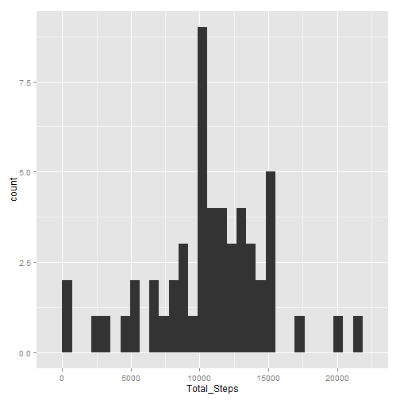
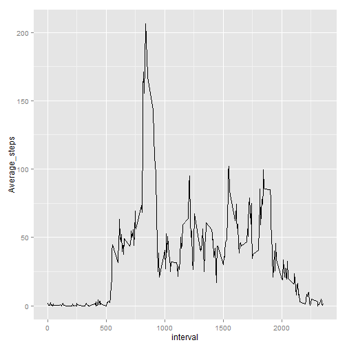
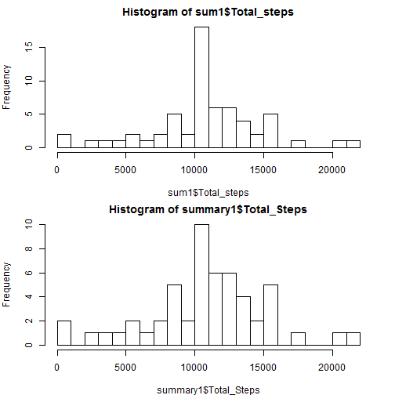
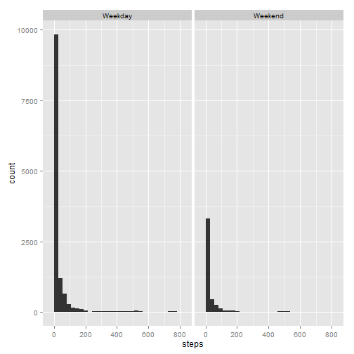
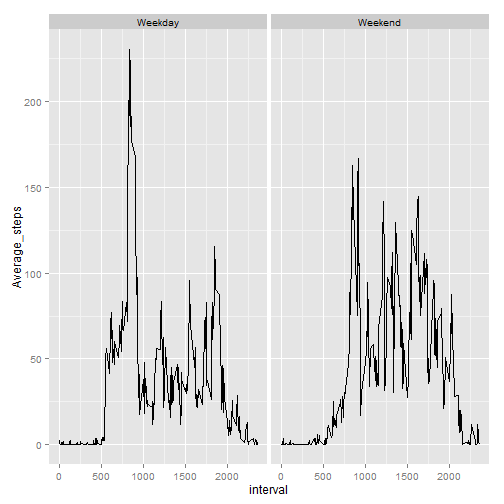

```r
# Loading basic libraries
library(ggplot2)
library(dplyr)
```


## Loading and preprocessing the data

```r
unzip("activity.zip")
activity<-read.csv("activity.csv")
str(activity)
```

```
## 'data.frame':	17568 obs. of  3 variables:
##  $ steps   : int  NA NA NA NA NA NA NA NA NA NA ...
##  $ date    : Factor w/ 61 levels "2012-10-01","2012-10-02",..: 1 1 1 1 1 1 1 1 1 1 ...
##  $ interval: int  0 5 10 15 20 25 30 35 40 45 ...
```

```r
summary(activity)
```

```
##      steps                date          interval     
##  Min.   :  0.00   2012-10-01:  288   Min.   :   0.0  
##  1st Qu.:  0.00   2012-10-02:  288   1st Qu.: 588.8  
##  Median :  0.00   2012-10-03:  288   Median :1177.5  
##  Mean   : 37.38   2012-10-04:  288   Mean   :1177.5  
##  3rd Qu.: 12.00   2012-10-05:  288   3rd Qu.:1766.2  
##  Max.   :806.00   2012-10-06:  288   Max.   :2355.0  
##  NA's   :2304     (Other)   :15840
```
We will perform the following steps to clean up the data.

* Convert The date column to a date object.


```r
activity$date<-as.Date(activity$date)
str(activity)
```

```
## 'data.frame':	17568 obs. of  3 variables:
##  $ steps   : int  NA NA NA NA NA NA NA NA NA NA ...
##  $ date    : Date, format: "2012-10-01" "2012-10-01" ...
##  $ interval: int  0 5 10 15 20 25 30 35 40 45 ...
```

```r
summary(activity)
```

```
##      steps             date               interval     
##  Min.   :  0.00   Min.   :2012-10-01   Min.   :   0.0  
##  1st Qu.:  0.00   1st Qu.:2012-10-16   1st Qu.: 588.8  
##  Median :  0.00   Median :2012-10-31   Median :1177.5  
##  Mean   : 37.38   Mean   :2012-10-31   Mean   :1177.5  
##  3rd Qu.: 12.00   3rd Qu.:2012-11-15   3rd Qu.:1766.2  
##  Max.   :806.00   Max.   :2012-11-30   Max.   :2355.0  
##  NA's   :2304
```

## What is mean total number of steps taken per day?

We will first create a new data set by striping out the missing values.

```r
activity1<-activity[complete.cases(activity),]
```

The next two steps are to,

* Calculate the total number of steps taken per day
* Calculate and report the mean and median of the total number of steps taken per day

```r
summary1<-activity1%>%
  group_by(date) %>%
  summarize(Total_Steps=sum(steps),Mean_steps=mean(steps),Median_Steps=median(steps))
print(summary1)
```

```
## Source: local data frame [53 x 4]
## 
##          date Total_Steps Mean_steps Median_Steps
##        (date)       (int)      (dbl)        (dbl)
## 1  2012-10-02         126    0.43750            0
## 2  2012-10-03       11352   39.41667            0
## 3  2012-10-04       12116   42.06944            0
## 4  2012-10-05       13294   46.15972            0
## 5  2012-10-06       15420   53.54167            0
## 6  2012-10-07       11015   38.24653            0
## 7  2012-10-09       12811   44.48264            0
## 8  2012-10-10        9900   34.37500            0
## 9  2012-10-11       10304   35.77778            0
## 10 2012-10-12       17382   60.35417            0
## ..        ...         ...        ...          ...
```

* Make a histogram of the total number of steps taken each day

```r
ggplot(summary1,aes(x=Total_Steps))+geom_histogram()
```

```
## stat_bin: binwidth defaulted to range/30. Use 'binwidth = x' to adjust this.
```

 

## What is the average daily activity pattern?

* Make a time series plot (i.e. type = "l") of the 5-minute interval (x-axis) and the average number of steps taken, averaged across all days (y-axis)


```r
sum1<-activity1 %>%
  group_by(interval) %>%
  summarize(Average_steps=mean(steps)) %>%
  print()
```

```
## Source: local data frame [288 x 2]
## 
##    interval Average_steps
##       (int)         (dbl)
## 1         0     1.7169811
## 2         5     0.3396226
## 3        10     0.1320755
## 4        15     0.1509434
## 5        20     0.0754717
## 6        25     2.0943396
## 7        30     0.5283019
## 8        35     0.8679245
## 9        40     0.0000000
## 10       45     1.4716981
## ..      ...           ...
```

```r
  ggplot(sum1,aes(x=interval,y=Average_steps))+geom_line()
```

 

```r
  max_row=head(arrange(sum1,desc(Average_steps)),1)
```

 *Q:* Which 5-minute interval, on average across all the days in the dataset, contains the maximum number of steps?

 *A:* The 5 minute interval with maximum number of steps is  ``835``

## Inputing missing values


Calculate and report the total number of missing values in the dataset (i.e. the total number of rows with NAs)

```r
  na_steps<-nrow(activity)-sum(complete.cases(activity$steps))
  na_date<-nrow(activity)-sum(complete.cases(activity$date))
  na_interval<-nrow(activity)-sum(complete.cases(activity$interval))
  na_rows<- nrow(activity)-sum(complete.cases(activity))
```
* 2304 steps are missing.
* 0 date are missing.
* 0 interval are missing.

*A:* Total of 2304 rows have missing values in the dataset.

*Q:* Devise a strategy for filling in all of the missing values in the dataset. The strategy does not need to be sophisticated. For example, you could use the mean/median for that day, or the mean for that 5-minute interval, etc. Create a new dataset that is equal to the original dataset but with the missing data filled in.
*A:* We will be using the mean of the interval group.


```r
new_activity<-activity%>%
    group_by(interval)%>%
    mutate(mean=mean(steps,na.rm=T))
new_activity$steps[!complete.cases(new_activity$steps)]<-new_activity$mean[!complete.cases(new_activity$steps)]
```


*Make a histogram of the total number of steps taken each day and Calculate and report the mean and median total number of steps taken per day. Do these values differ from the estimates from the first part of the assignment? What is the impact of imputing missing data on the estimates of the total daily number of steps?*


```r
sum1<-new_activity%>%ungroup()%>%group_by(date)%>%summarise(Total_steps=sum(steps),mean=mean(steps),median=median(steps))
par(mfrow=c(2,1),mar=c(4,4,2,2))
hist(sum1$Total_steps,breaks=20)
hist(summary1$Total_Steps,breaks=20)
```

 

*A:* We find that the pattern changes slightly after filling in the missing value.

## Are there differences in activity patterns between weekdays and weekends?

*Q:* Create a new factor variable in the dataset with two levels – “weekday” and “weekend” indicating whether a given date is a weekday or weekend day.


```r
factored<-new_activity%>%mutate(weekday=as.factor(ifelse((weekdays(date)=="Sunday"|weekdays(date)=="Saturday"),"Weekend","Weekday")))
ggplot(factored,aes(x=steps))+geom_histogram()+facet_wrap(~weekday)
```

```
## stat_bin: binwidth defaulted to range/30. Use 'binwidth = x' to adjust this.
## stat_bin: binwidth defaulted to range/30. Use 'binwidth = x' to adjust this.
```

 

*Q:* Make a panel plot containing a time series plot (i.e. type = "l") of the 5-minute interval (x-axis) and the average number of steps taken, averaged across all weekday days or weekend days (y-axis). See the README file in the GitHub repository to see an example of what this plot should look like using simulated data.

```r
 factored%>%
  ungroup()%>%
  group_by(weekday,interval) %>%
  summarise(Average_steps=mean(steps))%>%
ggplot(aes(x=interval,y=Average_steps))+geom_line()+facet_wrap(~ weekday)
```

 
